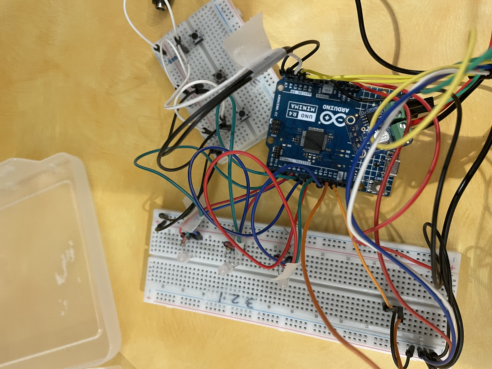
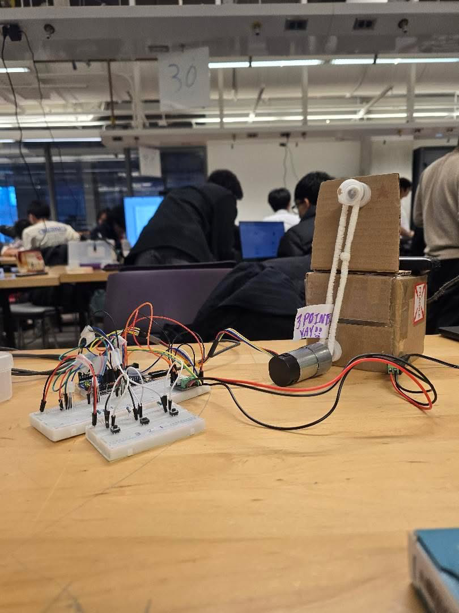

# 🧠 Cognitive Delirium Memory Game (Arduino)

A Simon Says–style **RGB LED memory game** built on an **Arduino Uno R4** to support cognitive monitoring for hospital patients at risk of delirium.

The game flashes a sequence of **LED + color** combinations, and the player must repeat the pattern using three buttons. Difficulty scales with pattern length, and successful rounds trigger a **motor reward system** that raises a small flag. Scores and rounds are printed to the **Serial Monitor** so they can be logged or sent to an external interface.

🔗 **Front-end / Patient Game Log:**  
[Patient Game Log Website](https://reflex-1bit.github.io/ece198/)

---

## 📸 Project Preview

### Breadboard + Arduino setup

### Final prototype

### 🎥 Demo Video
[▶ Watch the project demo](assets/demo.mov)

---

## ✨ Features

### 🔴🟢🔵 3 RGB LEDs + 3 buttons
- Each LED supports **Red, Green, and Blue**
- Each button corresponds to one LED
- Input system:
  - **1 click = Red**
  - **2 clicks = Green**
  - **3 clicks = Blue**

### 🎚️ Difficulty selection
- **Button 1 → Easy** (3-step pattern)
- **Button 2 → Medium** (5-step pattern)
- **Button 3 → Hard** (7-step pattern)

### ⏱️ Non-blocking pattern display
- Uses `millis()` instead of `delay()` for timing
- Keeps gameplay more responsive
- Pattern generation avoids immediate repeats to improve engagement

### 🏆 Scoring + motor reward
- Score increases when the player enters the full pattern correctly
- Every multiple of **3 points** activates the motor:
  - runs forward
  - then backward
- Score and rounds played are printed to the **Serial Monitor**

### 🔁 Game loop
- Show pattern
- Wait for player input
- Check correctness
- Update score
- Trigger reward or print correct pattern
- Let player continue or quit

---

## 🛠️ Hardware

- **Board:** Arduino Uno R4 (or compatible)
- **LEDs:** 3 × RGB LEDs with resistors
  - Pins `2–4`: LED 1 (R, G, B)
  - Pins `5–7`: LED 2 (R, G, B)
  - Pins `8–10`: LED 3 (R, G, B)
- **Buttons:** 3 × momentary push buttons
  - Connected to `A3`, `A4`, `A5`
  - Configured using `INPUT_PULLUP`
- **Motor:** 1 × DC motor with motor driver / H-bridge
  - Controlled using digital pins `11` and `12`
  - Activated with `analogWrite(...)`

> Note: confirm final wiring with your lab schematic before rebuilding the system.

---

## 🎮 How to Play

1. **Choose a difficulty**
   - Button 1 → Easy
   - Button 2 → Medium
   - Button 3 → Hard

2. **Start the round**
   - Press any button after selecting difficulty

3. **Watch the LED sequence**
   - The 3 RGB LEDs light up in a pattern
   - Each step contains:
     - which LED
     - which color

4. **Repeat the sequence**
   - Button 1 → LED 1
   - Button 2 → LED 2
   - Button 3 → LED 3
   - Click count determines color:
     - 1 click → Red
     - 2 clicks → Green
     - 3 clicks → Blue

5. **Get feedback**
   - Correct full sequence → score increases
   - Every multiple of 3 points → motor reward activates
   - Incorrect sequence → correct pattern is printed to Serial Monitor

6. **Continue or quit**
   - Button 1 after a round → play again
   - Button 2 or 3 → quit

---

## 🚀 Getting Started

1. Open `MemoryGame.ino` in the **Arduino IDE**
2. Select the correct board:
   - **Arduino Uno R4**
3. Select the correct COM port
4. Wire the hardware according to the pin assignments above
5. Upload the sketch
6. Open the **Serial Monitor** at **9600 baud**

---

## 🧩 Why This Project Matters

This project was designed as a simple and engaging cognitive game that could support patient monitoring in healthcare settings. By combining **memory recall**, **interactive hardware**, and **round/score logging**, it explores how embedded systems can be used in accessible health-focused applications.

It also demonstrates:
- **embedded systems design**
- **non-blocking timing with `millis()`**
- **hardware-software integration**
- **game logic and user input handling**
- **basic patient-facing interaction design**

---

## 🔮 Future Ideas

- Send score + rounds data directly to a PC app or web dashboard
- Tune timing and difficulty for different patient groups
- Save session summaries to EEPROM or SD card
- Add persistent high scores
- Add buzzer/audio feedback for richer interaction

---

## 👩‍💻 Author

**Siddhi Patel**  
First-year Computer Engineering Student  
University of Waterloo
